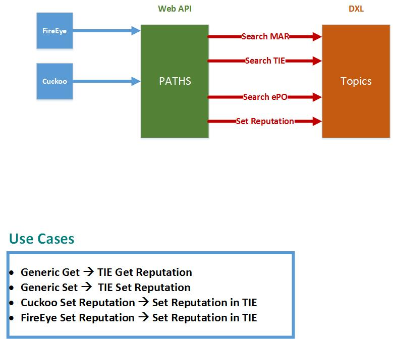

# OpenDXL Web API

The OpenDXL Web API was designed to allow the building of a scalable web tier.  The Web API can easily allow a single host to run the API or clusters in a cloud environment such as AWS, Google, or Apache Mesos.  

## Challenges To Solve
* **Lack of Python Support:**

     Many vendors allow automation from their equipment, but this support is often limited to technologies such as syslog, snmp, or URL POST/GET.
*  **Certificate Spread:**

     Certificate based authentication management and security can be a challenge as certficates become spread across and enterprise with each new deployment.  A couple of the problems this often causes in operations are:
            
    1. **Certificate Mismatch**
    
        Certificates are deployed with a fire and forget mindset.  The trouble occurs when certificates are reissued.  Typically there is no way to track clients that are using the original certificate.   
    2. **Outdated Certificates**
    
        Clients using certificates are a challenge for operations to track therefore they will use the original certificate and never reissue certificates.
* **Wrapper Services**
    While building a wrapper is a fine work around, it creates an operational challenge because it has to be maintained in tandem to the code being wrapped.  These types of services are easily forgotten upon upgrades.  Specifically to creater of Cuckoo said please do not create wrapper.

## Architecture

## Build and Deploy Project

How to perform the automated build for this project.  As well as how to deploy the code into a remote production system or test system.

[Build / Run Documentation](docs/build.md)

## Cuckoo

#### Configuration Examples
[Cuckoo Notification Configuration](docs/cuckoo.md)

## FireEye

#### Configuration Example
[FireEye Notification Configuration](docs/fireeye.md)

## TAXONOMY Of API

Taxonomy of the API is documented in the taxonomy documentaiton.  This highlights how the web api paths are structured and how it should be going forward.

[Taxonomy Documentation](docs/taxonomy.md)

## McAfee Trust Level Defined
[McAfee Trust Levels](docs/trustlevels.md)

## LICENSE
Copyright 2017 McAfee, Inc.

Licensed under the Apache License, Version 2.0 (the "License"); you may not use this file except in compliance with the License. You may obtain a copy of the License at

[http://www.apache.org/licenses/LICENSE-2.0](http://www.apache.org/licenses/LICENSE-2.0)

Unless required by applicable law or agreed to in writing, software distributed under the License is distributed on an "AS IS" BASIS, WITHOUT WARRANTIES OR CONDITIONS OF ANY KIND, either express or implied. See the License for the specific language governing permissions and limitations under the License.