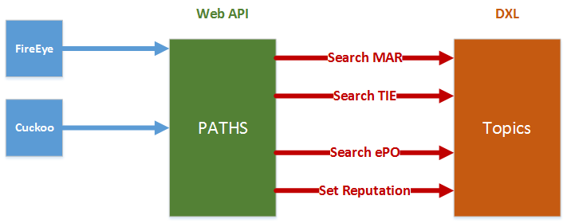

# OpenDXL Web API

The OpenDXL Web API was designed to allow the building of a scalable web tier.  The Web API can easily allow a single host to run the API or clusters in a cloud environment such as AWS, Google, or Apache Mesos.  

List of Challenges can be found [here](docs/challenges.md) 
Pre-requisites can be found [here](docs/Prerequisites.md)

## Architecture

### Horizontal Scaling Criteria
* **Scalable** - Ability to add new instances of this project to increase performance.
* **Composable** - resources are logically pooled so administrators do not have to physically configure hardware.
* **Autonomous** - The project code should be able to stand on its own without dependencies

## Use Cases
* Cuckoo Notification set TIE reputation with GET request (Using Generic Set)
* FireEye Notification set set TIE reputation with POST JSON
* Generic set TIE reputation with GET request
* Generic get TIE reputation with GET request
* Real-Time DXL Bus Monitoring [Instructions](docs/dxlmonitoring.md)

## Features
* Token Authentication
* Scalable Web API Tier
* Automated Build Development Environment
* Automated Deployment
* Set TIE file Reputation from HTTP
* Get TIE file Reputation from HTTP
* Set TIE file Reputation from FireEye Notification
* Streaming Monitoring Service for DXL Messages

## Development, Build, Deploy 

### Build Your Development Environment
If you are interested in coding then this will build your Development Environment in a virtual machine using Vagrant.
[Build Development](docs/dev.md)

### Deploy Using Docker To Production
For a portable environment free of dependencies Docker is a good choice.
[Deploy Docker](docs/dockerdeploy.md)

### Deploy Using Docker Swarm To Production
For a self-healing fault-tolerant environment Docker Swarm is a simple choice.
[Deploy Docker Swarm](docs/dockerswarm.md)

## SSL Encryption
The best way to enable SSL encryption is through an external load balancers (nginx, haproxy, Netscalers, or F5).  The load balancer can terminate the SSL encryption from the client.  This allows the backend to remain free and composable.

## TAXONOMY Of API

Taxonomy of the API is documented in the taxonomy documentation.  This highlights how the web api paths are structured and how it should be going forward.

[Taxonomy Documentation](docs/taxonomy.md)

### McAfee Trust Level Defined
[McAfee Trust Levels](docs/trustlevels.md)

## Vendor Support
### Cuckoo

#### Configuration Examples
[Cuckoo Notification Configuration](docs/cuckoo.md)

### FireEye

#### Configuration Example
[FireEye Notification Configuration](docs/fireeye.md)

### LICENSE
Copyright 2017 McAfee, Inc.

Licensed under the Apache License, Version 2.0 (the "License"); you may not use this file except in compliance with the License. You may obtain a copy of the License at

[http://www.apache.org/licenses/LICENSE-2.0](http://www.apache.org/licenses/LICENSE-2.0)

Unless required by applicable law or agreed to in writing, software distributed under the License is distributed on an "AS IS" BASIS, WITHOUT WARRANTIES OR CONDITIONS OF ANY KIND, either express or implied. See the License for the specific language governing permissions and limitations under the License.