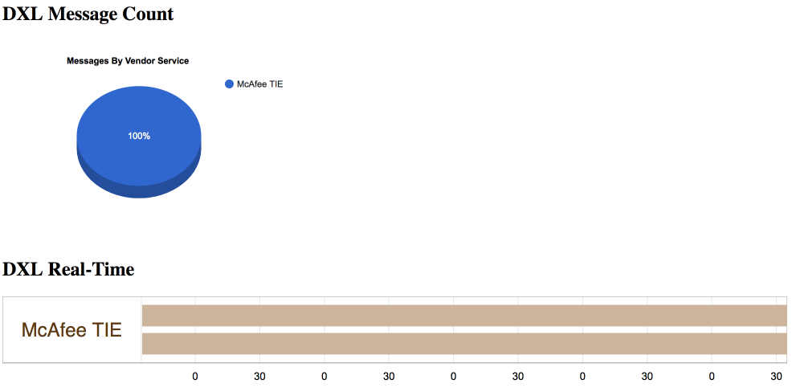
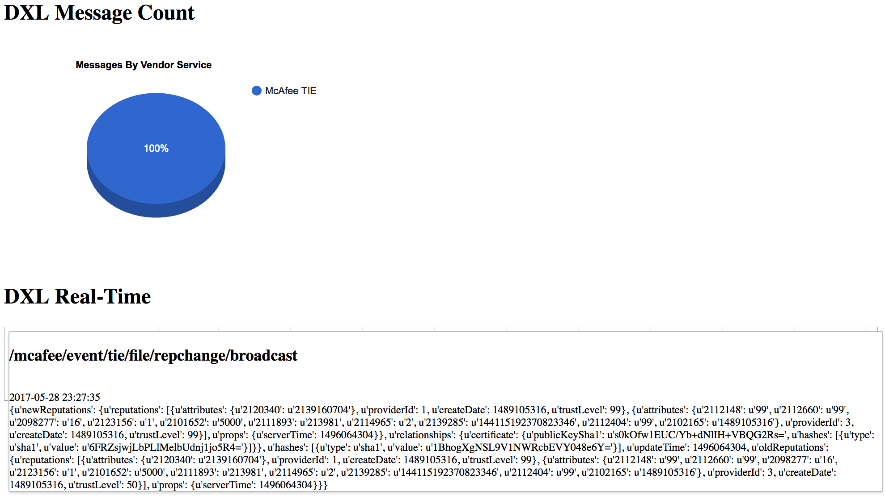

# DXL Monitoring

DXL monitoring monitors real-time communications on interesting topics.

## Configure Topics To Monitor
Edit monitor.config
```
[McAfeeTIE]
VendorID: mcafeetie
VendorName: McAfee TIE
VendorTopic: /mcafee/event/tie/file/repchange/broadcast

[McAfeeMAR]
VendorID: mcafeemar
VendorName: McAfee MAR
VendorTopic: /mcafee/mar/agent/query/all

[McAfeeEPO]
VendorID: mcafeeepo
VendorName: McAfee ePO
VendorTopic: /mcafee/event/epo/command/log

[ArubaCP]
VendorID: arubacp
VendorName: Aruba ClearPass
VendorTopic: /aruba/event/clearpass/log

[CheckPointFW]
VendorID: checkpointfw
VendorName: Check Point Firewall
VendorTopic: /checkpoint/event/detection
```

**VendorID:** Unique arbitrary vendor ID
**VendorName:** Name To Appear on Graphing
**VendorTopic:** Topic to monitor for messages

## Real-Time View


## DXL Message View
