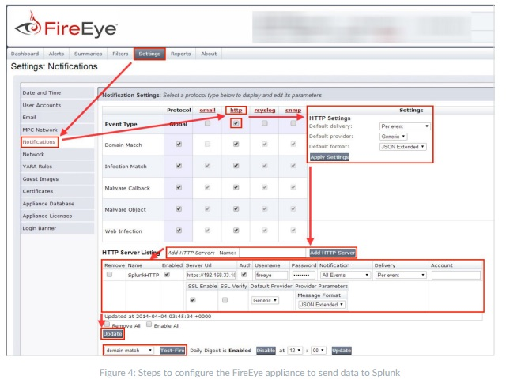

# FireEye Configuration

##Send JSON using HTTP POST

1. Log into the FireEye appliance with an administrator account
2. Click “Settings”
3. Click “Notifications”
4. Click the “http” hyperlink
5. Make sure the "Event type" check box is selected
6. If the Global HTTP Settings are already set—leave them
7. Add HTTP Server
8. Name Your Server (i.e. OpenDXLHTTP)
9. Check Enabled
10. Uncheck Auth
11. Check SSL Enabled

### URL: http://opendxlapi:5000/setfile?token=<your token>


   

### Curl Example
curl -H "Accept: application/json" -H "Content-type: application/json" -X POST -d @fireeye.json http://127.0.0.1:5000/tie/fireeye/setfile/<security token>

### Values Sent to TIE
* MD5 File Hash
* File Name of analysised file
* Comment 
* Trust Level known_malicious

### Fireeye JSON example
```
{"msg": "extended", "product": "Web MPS", "version": "7.7.0.123456", "appliance": "fireeye.foo.bar", "appliance-id": "00:11:11:11:11:11",
"alert": [
{
  "src": {
    "ip": "10.1.2.3",
    "host": "internalclient.intra.net",
    "vlan": "0", 
    "mac": "00:24:aa:aa:aa:aa"
  }, 
  "severity": "minr", 
  "alert-url": "https://fireeye.foo.bar/event_stream/events_for_bot?ma_id=12345678",
  "explanation": {
    "malware-detected": {
      "malware": {
        "profile": "win7x64-sp1", 
        "http-header": "POST http://malicious.com",
        "name": "Misc.Eicar-Test-File",
        "md5sum": "44d88612fea8a8f36de82e1278abb02f",
        "executed-at": "2016-01-19T08:30:21Z", 
        "application": "Windows Explorer", 
        "type": "exe", 
        "original": "driver.exe",
        "stype": "24"
      }
    },
    "protocol": "", 
    "analysis": "binary",
    "cnc-services": {
      "cnc-service": [
        {
          "protocol": "tcp",
          "port": "4143",
          "channel": "\\\\026\\\\003\\\\001",
          "address": "198.50.234.211"
        },
        {
          "protocol": "tcp",
          "port": "9943",
          "channel": "\\\\026\\\\003\\\\001",
          "address": "80.96.150.201"
        },
        {
          "protocol": "tcp",
          "port": "4493",
          "channel": "\\\\026\\\\003\\\\001",
          "address": "1.179.170.7"
        }
      ]
    },
    "anomaly": "98816"
  }, 
  "occurred": "2016-01-20 09:30:21+00", 
  "id": "12345678",
  "action": "notified", 
  "interface": {
    "mode": "tap"
  }, 
  "dst": {
    "ip": "10.1.2.4",
    "mac": "00:24:bb:bb:bb:bb"
  }, 
  "name": "malware-object"
}]}
```