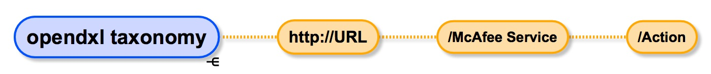

# OpenDXL Web API Taxonomy



Current Examples

## Base URL
* On local box ```http://127.0.0.1```
* Your Remote box will be defined by you ```http://mycoolhost```

## TIE "Threat Intelligence Exchange"
* Set TIE Reputation
```/tie/set```

* Get TIE Reputation
```/tie/get```

## About
* About the tool ```/about```
